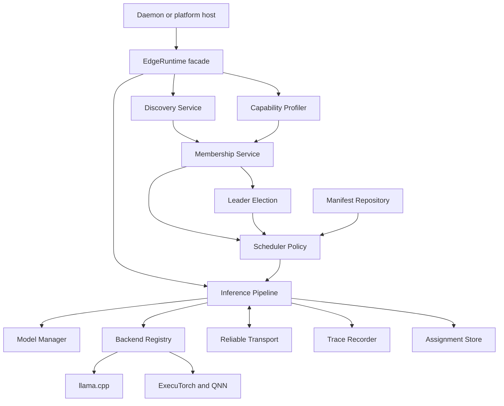
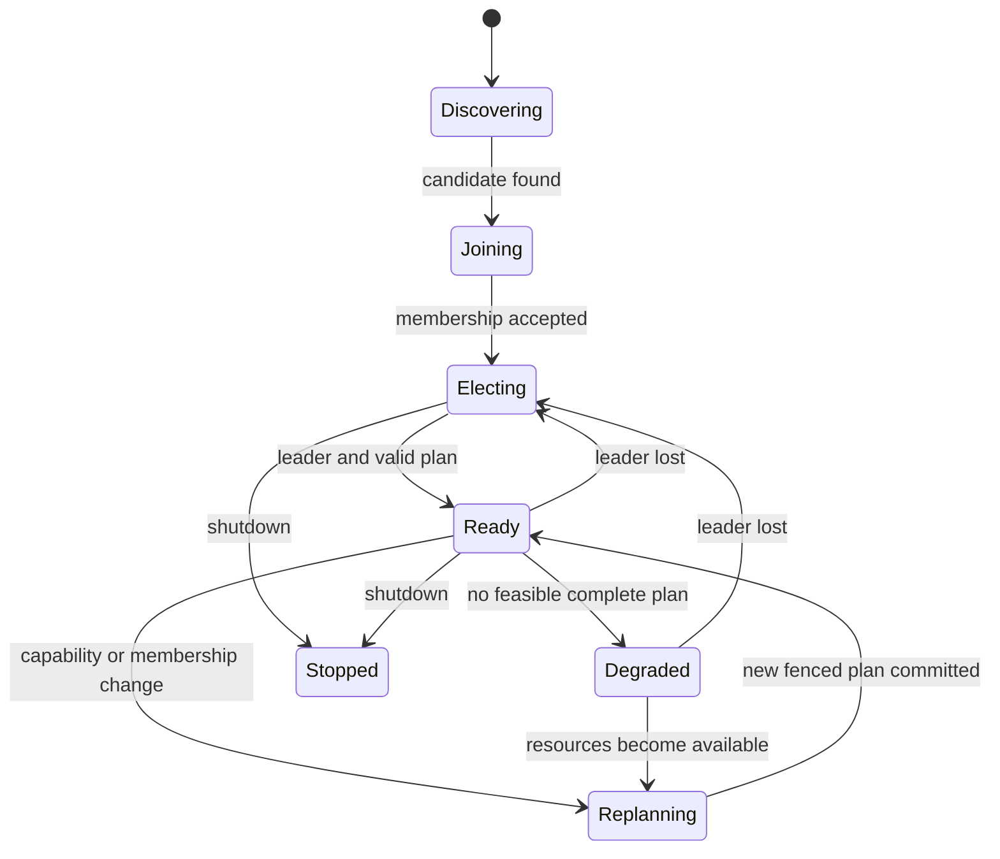

# Edge AI Runtime Engine Blueprint

**Blueprint version:** 1.0  
**Requirements baseline:** 2026-07-18  
**Design baseline:** Extracted runtime architecture, requirements, and validation guidance from blueprint v1.0.  
**Normative language:** **MUST**, **MUST NOT**, **SHOULD**, and **MAY** have their RFC 2119 meanings.

This document is the runtime-only architectural blueprint. It defines runtime behavior and contracts without prescribing source-level interfaces. Transformer layer ranges are zero-based, start-inclusive, and end-exclusive. KV cache state is owned by the device and backend executing its layers and is not transferred during normal inference.

Implementation sequencing is maintained separately in `IMPLEMENTATION_TASKS.md`. Repository-wide engineering rules are in `CODING_CONVENTIONS.md`. The canonical manifest schema is `proto/socrates/v1/model_manifest.proto`.

## 1. Runtime Architecture

### 1.1 System context



`EdgeRuntime` is the lifecycle and host-facing boundary. It composes discovery, authenticated membership, election, profiling, scheduling, local artifact management, inference backends, transport, recovery, tracing, and persistence. Vendor backend, platform SDK, and transport types remain behind runtime-owned contracts.

### 1.2 Per-token data path

```mermaid
sequenceDiagram
    participant Host as Host Application
    participant Leader as Leader Runtime
    participant A as First-stage Device
    participant B as Intermediate Device
    participant C as Final-stage Device

    Host->>Leader: Generate request
    Leader->>A: Begin request with fenced plan
    A->>A: Embedding and assigned layers; retain local KV
    A->>B: Ordered hidden-state frame
    B->>B: Assigned layers; retain local KV
    B->>C: Ordered hidden-state frame
    C->>C: Assigned layers and LM head; retain local KV
    C-->>Leader: Token event
    Leader-->>Host: Stream token event
```

Only activation tensors cross devices. Model weights and KV caches do not. When a node fails, the leader creates a new fenced plan. A replacement stage rebuilds local KV state by replaying retained token history; portable backend-native KV migration is not assumed.

### 1.3 Control-plane state model



Discovery produces candidates, not trusted members. Admission authenticates candidates before they affect membership. A runtime is ready only when it has an elected leader and a valid complete plan. Membership, capability, or leadership changes force replanning or graceful degradation.

## 2. Architectural Invariants

1. Discovery is not membership or trust. A candidate is authenticated before joining.
2. All leader-authored mutations carry `(term, fencing_token, membership_revision)` and stale mutations are rejected.
3. Capability reports expire; scheduling never uses stale dynamic memory or network measurements.
4. A plan references concrete pre-sharded artifacts. Runtime graph surgery is outside the MVP.
5. The model manager never downloads a complete model; MVP paths resolve preloaded local artifacts only.
6. Scheduler policies are pure with respect to supplied snapshots; transport and backend calls occur outside scheduling.
7. Every stage assignment satisfies memory, quantization, artifact-format, backend, and hardware constraints.
8. Hidden-state streams are bounded, ordered, checksummed, deadline-aware, and backpressured.
9. KV caches remain local to their layer-owning backend session.
10. CPU fallback is explicit in a new or pre-authorized plan; it is not a hidden backend side effect.
11. Tracing is metadata-only by default and never records prompts, weights, hidden states, KV values, or secrets.
12. Public contracts do not expose llama.cpp, ExecuTorch, QNN, gRPC, or platform SDK types.
13. Expected operational results contain exactly one success value or one stable error. Published value objects are immutable and safe to copy between threads.
14. Runtime shutdown is idempotent, drains or cancels owned work, and quiesces callbacks before releasing dependencies.

## 3. Component Responsibilities

| Component | Responsibility |
|---|---|
| `DiscoveryService` | Emit untrusted nearby-node candidates using mDNS, UDP broadcast, then Bluetooth fallback without user configuration. Coalesce duplicate advertisements and release platform discovery resources during stop. |
| `IdentityProvider` | Create or load a stable local identity and authenticate discovered candidates. Ephemeral local clusters require proof of a shared cluster credential; pinned allowlists and private-CA trust are supported; unauthenticated mode is not. |
| `MembershipService` | Maintain monotonically revisioned joining/live/suspect/left membership, authenticate admissions, track heartbeats, publish fresh capabilities, and propagate joins and leaves. |
| `LeaderElection` | Elect one coordinator and provide monotonically increasing terms and fencing tokens. The MVP uses fenced Bully-style election; a consensus-backed implementation may replace it without changing public contracts. |
| `CapabilityProfiler` | Report hardware, supported backends and quantizations, measured throughput and latency, network bandwidth, available memory, and accelerator availability with an explicit validity interval. |
| `Scheduler` | Convert an immutable manifest and capability snapshot into a deterministic, validated, ordered pipeline plan without performing transport or backend operations. |
| `MemoryScheduler` | Create contiguous stage assignments based on fresh usable memory and estimated stage cost. |
| `SensitivityScheduler` | Select shard quantizations from calibration sensitivity and permit device interleaving while preserving ordered stage ordinals and complete layer coverage. |
| `ManifestRepository` | Parse, validate, and index immutable versioned manifest envelopes; reject conflicting bytes for an existing manifest identity. |
| `ModelManager` | Resolve only preloaded artifacts beneath configured model roots, verify size and digest before load, and lease only shards assigned to the local node. |
| `Transport` | Provide transport-independent unary, ordered stream, and broadcast behavior. The MVP gRPC adapter uses mTLS, message limits, deadlines, keepalives, backpressure, checksums, and bounded deduplication. |
| `InferenceBackend` | Load one backend-specific shard, execute an explicit layer range, own local backend session and KV state, and expose no vendor types to callers. |
| `BackendRegistry` | Report available backends, validate compatibility, and expose an explicit QNN-to-CPU fallback chain authorized by the selected plan. |
| `InferencePipeline` | Run prefill and decode across ordered stages, enforce leadership and plan fences, own request cancellation, detect node loss, replay retained token history after replanning, and stream ordered tokens. |
| `TraceRecorder` | Record scheduling, layer, transfer, and token metadata when enabled and atomically export completed traces without sensitive payloads. |
| `AssignmentStore` | Persist the last valid assignments and bounded request token history required for recovery and replay. |
| `EdgeRuntime` | Own startup, rollback, stop/drain, subsystem ordering, immutable snapshot publication, and the stable host-facing runtime API. |
| Stable C ABI | Serve as the only boundary consumed by JNI, ObjC++, C++/WinRT, daemons, and optional Python bindings; translate failures without allowing exceptions or backend-specific types across the boundary. |
| Offline Python tooling | Create backend-specific pre-shards, calibration metadata, manifests, and validation reports. It does not download models or perform distributed runtime execution. |

## 4. Cross-Component Runtime Rules

### 4.1 Identity, membership, and election

Zero-configuration setup does not imply unauthenticated operation. Ephemeral cluster mode creates a local cluster key on first launch and admits only peers that prove possession of the same credential. Membership revisions never decrease. Candidate discovery alone never marks a peer alive.

Leadership terms and fencing tokens protect every leader-authored mutation. A restarted or partitioned former leader cannot commit assignments or pipeline actions after a newer fence is accepted. Election persistence must prevent term rollback across restart.

### 4.2 Scheduling and placement

Schedulers consume only supplied immutable manifests, membership snapshots, capability reports, and policy inputs. They produce deterministic plans for equal inputs. Plans cover every graph stage in order, use concrete local artifact shards, and satisfy memory reserve, projected KV growth, backend version, execution-provider, operator, quantization, artifact-format, and hardware constraints.

Sensitivity-aware placement may alternate devices, but stage ordinal and model graph order remain monotonic. Infeasible placement is explicit and leaves the runtime degraded; it must not silently omit stages, overcommit memory, or change quantization.

### 4.3 Transport and deadlines

The initial adapter maps runtime transport behavior to gRPC unary and bidirectional streams over mTLS. Ethernet uses the same IP/gRPC adapter. USB, QUIC, and WebRTC are future adapters.

A sender transmits both UTC expiry and remaining duration. A receiver creates a local monotonic deadline from the smaller non-negative budget after configured clock-skew tolerance. A local monotonic time point is never serialized. Plan issue time and validity use the same conversion before dispatch.

Activation streams enforce bounded queues, sequence order, checksums, deadlines, cancellation, and backpressure. Loss, reordering, timeout, checksum mismatch, and stale-fence handling must be observable as explicit recovery or failure; frames are never silently dropped.

### 4.4 Backend execution and recovery

Backend sessions own their layer-local KV caches. A failure invalidates stale stage work. The leader admits a replacement only under a newer valid plan fence, reloads assigned local shards, and replays retained token history to reconstruct KV state. If complete recovery is impossible, the request terminates or the runtime enters explicit degradation.

CPU fallback requires a compatible manifest profile and plan authorization. Backend loading verifies the exact artifact bytes before execution.

### 4.5 Lifecycle, callbacks, and observability

Startup either reaches a coherent running state or rolls back already-started dependencies. Stop is idempotent. User callbacks are serialized where promised, are never invoked while subsystem mutation locks are held, and cannot begin after stop reports callback quiescence.

Tracing and logs carry identifiers, decisions, timing, and failure metadata only. Prompts, tensors, model weights, KV data, credentials, and secrets are prohibited. Trace export is limited to completed traces and writes atomically to an approved destination.

## 5. Model Manifest Design

The canonical schema is `proto/socrates/v1/model_manifest.proto`; this blueprint does not duplicate its declarations. Generated representations must come from that file and must not be hand-edited.

The distributed unit is a `ModelManifestEnvelope`. Its manifest payload is the exact serialized `ModelManifest` byte sequence, accompanied by a SHA-256 digest over those exact bytes. This avoids dependence on canonical Protobuf serialization. Protobuf JSON mapping may be used for inspection, but binary payloads and raw 32-byte digests are authoritative.

A manifest describes these related concerns:

- **Identity and versioning:** schema version, immutable manifest identity, creation time, model ID/revision, architecture, parameter count, and tokenizer artifact reference.
- **Graph:** ordered embedding, transformer, output-normalization, and LM-head stages; exact transformer layer coverage; typed tensor boundaries; and transferability. Local-only state such as KV is represented as non-transferable.
- **Tensor contracts:** semantic, data type, fixed or dynamic dimensions, exact layout, alignment, byte bound, and endianness at each graph boundary.
- **Quantization:** a stable quantization identity covering kind, activation, compute and accumulator types, group size, and exact scheme.
- **Artifacts:** immutable format-versioned sets of ordinal shards, their stage/layer coverage, role, quantization, local URI, size, digest, memory/KV estimates, and compatible execution profiles.
- **Execution profiles:** artifact sets plus backend version, required compute units and features/providers, hardware limits, operator coverage, and an optional explicit acyclic CPU fallback profile.
- **Calibration:** dataset/sample identity and per-layer compute, memory, and quality-sensitivity evidence used by scheduling.
- **Integrity constraints:** required validation rules, permitted URI schemes, artifact size limits, and immutable-URI policy.

### 5.1 Mandatory semantic validation

1. IDs match `[A-Za-z0-9][A-Za-z0-9._-]{0,127}` and are unique in their namespace.
2. Every SHA-256 field is exactly 32 bytes; the envelope digest matches the exact manifest payload bytes.
3. Unknown fields are always rejected for schema version 1. Declarative integrity evidence cannot weaken this validator requirement.
4. Graph stage ordinals are exactly `0..N-1`; all stage references resolve.
5. Transformer layer ranges are valid and exactly cover `[0, total_transformer_layers)` without overlap or gaps in graph order.
6. Embedding precedes transformer stages; output normalization and LM head follow them.
7. Every boundary has a valid producer and consumer except explicit model input/output; non-transferable boundaries MUST NOT connect different devices.
8. Tensor dimensions have exactly one extent; dynamic minima and maxima are ordered; alignment is zero or a power of two.
9. Hidden-state `maximum_encoded_bytes` SHOULD be at most 30 KiB per token for target models. A larger value requires an explicit manifest annotation and performance waiver.
10. Artifact URIs use an allowed scheme. MVP deployments allow immutable relative local `file:` URIs and reject traversal outside model roots.
11. Artifact-set shard ordinals are exactly `0..shard_count-1`; all entries report the same count.
12. Blob size and SHA-256 are verified before backend loading. `ordered_shards_sha256` is the SHA-256 of raw shard digest bytes in ordinal order.
13. Every quantization, profile, operator, and fallback reference resolves. Backend compatibility matches the exact quantization identity, including kind, scheme, group size, activation type, and compute type—not only the broad quantization kind. Fallback profiles use the CPU backend, have compatible artifacts, and cannot form cycles.
14. Every selected execution profile covers all operators and stage artifacts it claims.
15. Every calibration layer is in range; scores are finite; duplicate layer/quantization/profile entries are rejected.
16. Peak runtime memory plus configured reserve and projected KV growth fits the device's fresh available memory.
17. Conflicting bytes for an existing `(model_id, revision, manifest_id)` are rejected as data loss.
18. Version strings use SemVer 2.0.0 without a leading `v`; ranges are minimum-inclusive and maximum-exclusive, with an empty maximum meaning unbounded.
19. Every required-compute-unit list is conjunctive. Alternative hardware choices require separate execution profiles.
20. MVP artifact URIs exactly match `file:./<normalized-relative-path>`: UTF-8 segments, `/` separators, and no empty, `.`, `..`, absolute, query, fragment, percent-encoded separator, or symlink escape from the configured model root.

## 6. Build, Run, and Test

Commands are run from the `socrates` repository unless noted otherwise. They describe the intended scaffold and become available as their owning implementation tasks land.

### 6.1 macOS prerequisites

Install current Xcode and command-line tools, then install the native, schema, Python, Android, and container toolchain:

```sh
sudo xcode-select --switch /Applications/Xcode.app/Contents/Developer
sudo xcodebuild -runFirstLaunch
brew update
brew install cmake ninja conan protobuf buf pkg-config openssl@3 grpc python@3.12
brew install --cask temurin@17 android-studio docker
conan profile detect --force
```

For Android, install SDK Platform 35, Build Tools 35.0.0, CMake 3.22.1, and NDK 27.1.12297006. Configure literal `JAVA_HOME` and `ANDROID_HOME` values for the local machine; do not commit machine-specific paths.

### 6.2 Generate and validate schemas

```sh
buf lint
buf build
buf generate
buf breaking --against .git#branch=main
```

Run the breaking check after a release baseline exists.

### 6.3 Build and test on macOS

```sh
conan install . --output-folder=build/conan-debug --build=missing --settings=build_type=Debug
cmake --preset macos-debug
cmake --build --preset macos-debug --parallel
ctest --preset macos-debug --output-on-failure
```

Release and package:

```sh
conan install . --output-folder=build/conan-release --build=missing --settings=build_type=Release
cmake --preset macos-release
cmake --build --preset macos-release --parallel
cmake --install build/macos-release --prefix build/package/macos
cpack --config build/macos-release/CPackConfig.cmake
```

### 6.4 Apple runtime package

```sh
cmake --preset ios-device-release
cmake --build --preset ios-device-release --parallel
cmake --preset ios-simulator-release
cmake --build --preset ios-simulator-release --parallel
xcodebuild -create-xcframework -library build/ios-device-release/libsocrates.a -headers include -library build/ios-simulator-release/libsocrates.a -headers include -output build/package/SocratesEngine.xcframework
```

QNN is not an iOS backend. Apple builds use compatible enabled backends such as llama.cpp CPU/Metal.

### 6.5 Android runtime package

```sh
cmake --preset android-arm64-release
cmake --build --preset android-arm64-release --parallel
./scripts/build_android.sh --abi arm64-v8a --configuration Release
```

For emulator contract tests:

```sh
cmake --preset android-x86_64-debug
cmake --build --preset android-x86_64-debug --parallel
```

QNN SDK paths and licenses come from developer or CI secret configuration and are never committed. Builds without QNN set `-DSOCRATES_ENABLE_QNN=OFF` and retain the CPU-compatible adapters.

### 6.6 Windows runtime package

Run on an authoritative Windows x64/ARM64 host with Visual Studio 2022, CMake, Ninja, Conan 2, and WiX:

```powershell
conan profile detect --force
conan install . --output-folder=build/conan-release --build=missing --settings=build_type=Release
cmake --preset windows-x64-release
cmake --build --preset windows-x64-release --parallel
ctest --preset windows-x64-release --output-on-failure
cpack --config build/windows-x64-release/CPackConfig.cmake
```

### 6.7 Python tooling

```sh
python3.12 -m venv .venv
. .venv/bin/activate
python -m pip install --upgrade pip
python -m pip install -e '.[dev]'
ruff check python tests
black --check python tests
pyright python
pytest -q
```

After the corresponding tools are implemented:

```sh
socrates-manifest validate fixtures/models/tinyllama/manifest.pb --verify-artifacts
socrates-shard create --backend llama-cpp --model models/source --plan configs/tinyllama-shards.json
socrates-calibrate sensitivity --model models/source --dataset fixtures/calibration/sample_prompts.jsonl
```

### 6.8 Focused runtime tests and sanitizers

```sh
ctest --test-dir build/macos-debug -L unit --output-on-failure
ctest --test-dir build/macos-debug -L contract --output-on-failure
ctest --test-dir build/macos-debug -L integration --output-on-failure
cmake --preset macos-asan
cmake --build --preset macos-asan --parallel
ctest --preset macos-asan --output-on-failure
cmake --preset macos-tsan
cmake --build --preset macos-tsan --parallel
ctest --preset macos-tsan --output-on-failure
```

### 6.9 Multi-node E2E

Docker suites use deterministic seeded discovery in all CI runs and host-network/multicast discovery on Linux CI because Docker Desktop multicast behavior varies.

```sh
cd tests/e2e
docker compose build --no-cache
docker compose up -d node-a node-b node-c test-controller
docker compose run --rm test-controller pytest -q scenarios/test_cluster_formation.py
docker compose run --rm test-controller pytest -q scenarios/test_streaming_pipeline.py
docker compose run --rm test-controller pytest -q scenarios/test_worker_loss.py
docker compose run --rm test-controller pytest -q scenarios/test_leader_loss.py
docker compose run --rm test-controller pytest -q scenarios/test_incompatible_capacity.py
docker compose down --volumes --remove-orphans
```

The controller asserts cluster convergence, one leader, monotonic fences, complete plans, ordered token events, checksum validation, graceful infeasibility, and trace export. The deterministic synthetic backend is the default; backend-specific TinyLlama tests run only on compatible hardware jobs.

### 6.10 Runtime tools

```sh
cmake --build --preset macos-release --target socrates-profiler socrates-benchmark socrates-manifest-validator socrates-trace-replay
build/macos-release/tools/socrates-profiler --output build/results/capability.json
build/macos-release/tools/socrates-benchmark --manifest fixtures/models/tinyllama/manifest.pb --warmup 3 --runs 10 --output build/results/benchmark.json
build/macos-release/tools/socrates-manifest-validator fixtures/models/tinyllama/manifest.pb --verify-artifacts
build/macos-release/tools/socrates-trace-replay build/traces/request.pb --summary
```

Benchmark reports validate against `configs/benchmark.schema.json`. Compare baselines only for equivalent hardware, manifest revision, backend, and power state, using explicit tracked hardware thresholds.

### 6.11 Runtime release gate

A releasable runtime requires schema lint/generation/compatibility checks; C++ formatting, static analysis, unit/contract/integration tests and supported sanitizers; Python lint, formatting, type checks and tests; authoritative platform packages; three-node formation and streaming; worker- and leader-loss recovery; corruption and stale-fence security tests; payload-safe trace export; and archived profiler/benchmark results with build metadata.
